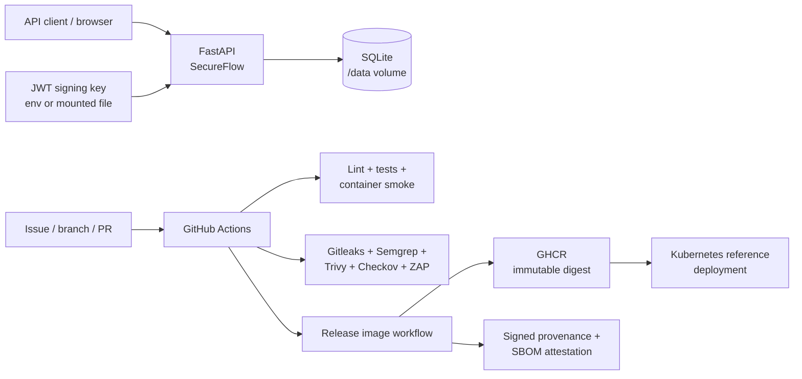

# SecureFlow DevSecOps

[](https://github.com/simplyy-shadin/secureflow-devsecops/actions/workflows/ci.yml)
[](https://github.com/simplyy-shadin/secureflow-devsecops/actions/workflows/secret-scan.yml)
[](https://github.com/simplyy-shadin/secureflow-devsecops/actions/workflows/sast.yml)
[](https://github.com/simplyy-shadin/secureflow-devsecops/actions/workflows/supply-chain.yml)
[](https://github.com/simplyy-shadin/secureflow-devsecops/actions/workflows/iac-security.yml)
[](https://github.com/simplyy-shadin/secureflow-devsecops/actions/workflows/dast.yml)

SecureFlow is a hands-on application security and DevSecOps project that builds security controls into a small FastAPI service, its CI/CD pipeline, container image, release process, and Kubernetes reference deployment.

The project is intentionally developed through issues and pull requests so the history shows more than a final green pipeline: findings, failed gates, remediation decisions, temporary exceptions, and their eventual removal remain visible.

## What this project demonstrates

- secure registration and short-lived JWT authentication
- Argon2id password hashing and generic authentication failures
- hardened non-root, read-only container runtime
- secret scanning across Git history with a controlled detection self-test
- SAST with Semgrep plus project-owned security rules and rule tests
- dependency and container vulnerability gates with Trivy
- CycloneDX SBOM generation
- Checkov policy enforcement for Kubernetes IaC
- OWASP ZAP baseline DAST with explicit FAIL/WARN/INFO handling
- STRIDE threat modeling and documented residual risk
- immutable GHCR image publication
- signed build provenance and signed SBOM attestations
- Kubernetes deployment pinned to the real registry-provided image digest

## Architecture



## Application surface

| Endpoint | Purpose | Authentication |
| --- | --- | --- |
| `GET /health` | Health/version response | No |
| `POST /auth/register` | Register a user with Argon2id password hashing | No |
| `POST /auth/login` | Issue a short-lived Bearer JWT | No |
| `GET /users/me` | Return the authenticated user's safe profile | Bearer JWT |
| `GET /docs` | FastAPI Swagger UI | No |
| `GET /openapi.json` | OpenAPI schema | No |

JWTs validate signature, issuer, audience, expiry, issued-at time and subject. Signing material is never committed to the repository. See [Authentication design](docs/authentication.md).

## Security gates

| Layer | Control | Gate behavior |
| --- | --- | --- |
| Code quality | Ruff + pytest | Any lint/test failure blocks CI |
| Secrets | Gitleaks | Detection or scanner-control failure blocks |
| SAST | Semgrep | ERROR findings and custom-rule failures block |
| Dependencies | Trivy filesystem SCA | Fixed HIGH/CRITICAL vulnerabilities block |
| Container | Trivy image scan | Fixed HIGH/CRITICAL vulnerabilities block |
| IaC | Checkov | Kubernetes policy failures block |
| DAST | OWASP ZAP Baseline | Rules classified `FAIL` block; documented WARN/INFO findings remain visible |
| Release | SBOM + attestations | Broken build/SBOM, invalid tag, publish or attestation failure blocks |

The gate rationale, evidence model, and finding-response rules are documented in [docs/security-gates.md](docs/security-gates.md).

## Hardened runtime

The Docker and Kubernetes configurations carry the same core runtime assumptions:

- deterministic non-root UID/GID `10001`
- read-only root filesystem
- writable data isolated to `/data`
- temporary writes isolated to `/tmp`
- all Linux capabilities dropped
- privilege escalation disabled
- pip removed from the runtime image
- health probes
- Kubernetes `RuntimeDefault` seccomp
- resource requests/limits
- service-account token automount disabled
- ClusterIP-only service
- explicit NetworkPolicy
- JWT signing key mounted read-only as a file in Kubernetes

See [Container security](docs/container-security.md) and [Kubernetes security](docs/kubernetes-security.md).

## Published release evidence

The first published image release is `v0.1.0`, built from:

```text
e89251f71695d15f78ed888d59921b49cc46b839
```

Immutable image reference:

```text
ghcr.io/simplyy-shadin/secureflow-devsecops@sha256:93a26b7b9d665574026e9dd850a75670363f97dfacda4c736babc307ab80d32c
```

The release workflow generated a CycloneDX SBOM against that published digest and created signed GitHub build-provenance and SBOM attestations. The Kubernetes Deployment now references this exact digest, closing the earlier image-pinning gap without using a fabricated placeholder.

Verification commands and release evidence are in [docs/release-security.md](docs/release-security.md).

## Quick start

### Python

Requires Python 3.12 or later.

```bash
python -m venv .venv
```

Activate the virtual environment, then:

```bash
pip install -r requirements-dev.txt
```

Copy `.env.example` to `.env`, generate a development-only signing key:

```bash
python -c "import secrets; print(secrets.token_hex(32))"
```

Place the value after `JWT_SECRET_KEY=` in the ignored `.env` file.

Run:

```bash
ruff check app tests
pytest -q
uvicorn app.main:app --reload
```

Open:

```text
http://127.0.0.1:8000/docs
```

Windows activation/setup details are in [docs/local-development.md](docs/local-development.md).

### Docker

With the same local `.env` present:

```bash
docker compose up --build -d
docker compose ps
```

The service should report healthy on port `8000`.

For reproducible local security checks covering Docker hardening, Gitleaks, Semgrep, Trivy, SBOM generation, Checkov, and ZAP, see [docs/local-validation.md](docs/local-validation.md).

## Security-control documentation

| Area | Documentation |
| --- | --- |
| Authentication | [docs/authentication.md](docs/authentication.md) |
| Container hardening | [docs/container-security.md](docs/container-security.md) |
| Local development | [docs/local-development.md](docs/local-development.md) |
| Local security validation | [docs/local-validation.md](docs/local-validation.md) |
| Secret scanning | [docs/secret-scanning.md](docs/secret-scanning.md) |
| Static analysis | [docs/static-analysis.md](docs/static-analysis.md) |
| Dependency/container security | [docs/supply-chain-security.md](docs/supply-chain-security.md) |
| DAST remediation case study | [docs/dast-remediation.md](docs/dast-remediation.md) |
| Security gate model | [docs/security-gates.md](docs/security-gates.md) |
| STRIDE threat model | [docs/threat-model.md](docs/threat-model.md) |
| Kubernetes/IaC security | [docs/kubernetes-security.md](docs/kubernetes-security.md) |
| Release/SBOM/provenance | [docs/release-security.md](docs/release-security.md) |

## Engineering workflow

SecureFlow follows an issue-driven workflow:

```text
issue -> focused branch -> commits -> pull request -> security gates -> remediation -> merge
```

Security controls are treated as engineering controls rather than scanner decorations. Examples in the repository history include:

- remediating real PyJWT HIGH vulnerabilities found by Trivy;
- replacing broad secret-like test literals instead of weakening Gitleaks;
- testing custom Semgrep rules with controlled vulnerable/safe examples;
- remediating ZAP response-header findings and keeping justified residual warnings visible;
- temporarily documenting the missing Kubernetes image digest, then publishing a real image, pinning its registry digest, and removing the Checkov exception.

See [CONTRIBUTING.md](CONTRIBUTING.md) for the contribution workflow and [SECURITY.md](SECURITY.md) for vulnerability reporting.

## Deliberate boundaries

SecureFlow is a portfolio/reference security-engineering project, not a claim of production readiness. Current residual boundaries include:

- no production TLS termination or HSTS boundary
- no distributed login/registration rate limiting
- no refresh-token or revocation infrastructure
- minimal runtime security/audit logging
- SQLite and startup-time table creation instead of a managed database and migrations
- no multi-object authorization model beyond `/users/me`
- Swagger/OpenAPI remains enabled for the development/reference deployment

These are tracked as explicit residual risks in the [threat model](docs/threat-model.md), rather than being implied as solved by a green scanner result.
