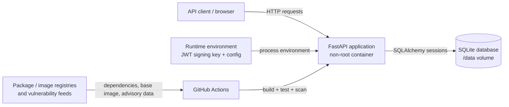

# SecureFlow threat model

## Scope

This threat model covers the current SecureFlow API, its local container runtime, SQLite persistence, authentication flow, and the CI security controls that produce and validate the deployable image.

The model describes the project as it exists today. It does not assume a production API gateway, managed database, TLS terminator, or centralized identity provider that is not present in the repository.

## Architecture



## Trust boundaries

### TB1 — Untrusted client to API

Anything received over HTTP is attacker-controlled until validated. This includes JSON request bodies, bearer tokens, headers, paths, and query data.

Current controls include Pydantic validation, fixed authentication algorithms, generic login errors, SQLAlchemy query construction, and response schemas that exclude password hashes.

### TB2 — Application process to persistent data

The application process can read and modify the SQLite database mounted at `/data`.

Current controls include a non-root runtime user, a read-only root filesystem, a dedicated writable data volume, and ORM-based database access.

### TB3 — Runtime configuration to application

Runtime configuration enters the application through environment variables and, in Kubernetes, a read-only mounted secret file for the JWT signing key.

The repository provides configuration names and mount paths but no signing material. Local/container development uses an ignored environment-backed key, while the Kubernetes reference deployment exposes only `JWT_SECRET_KEY_FILE` and mounts the secret value out of band. Gitleaks scans current content and Git history for committed credentials.

### TB4 — Source repository to CI runner

Pull-request content is untrusted input to build and security automation.

Actions are pinned to immutable commit SHAs where practical, workflow token permissions are minimized per workflow, and security controls run independently so one control is not treated as proof for another.

### TB5 — CI runner to external supply-chain sources

Package indexes, container registries, scanner releases, and vulnerability databases are outside SecureFlow's direct control.

Direct application dependencies are pinned, the runtime base image is digest-pinned, security action code is commit-pinned, and vulnerability databases remain updateable so advisory data does not become stale.

## Security assets

| Asset | Security objective |
| --- | --- |
| User passwords | Never persist or return plaintext; resist offline cracking |
| Password hashes | Prevent disclosure and unauthorized modification |
| JWT signing key | Maintain confidentiality and integrity |
| Access tokens | Prevent theft, forgery, replay beyond intended lifetime, and claim confusion |
| User identity/email | Prevent unauthorized disclosure or account confusion |
| SQLite data | Preserve confidentiality, integrity, and availability |
| Application source/config | Prevent malicious or accidental security regressions |
| Container image | Preserve provenance and prevent known actionable vulnerable components |
| CI security reports | Preserve evidence needed to review findings and gate decisions |

## Attack surface

Current HTTP entry points are:

```text
GET  /health
POST /auth/register
POST /auth/login
GET  /users/me
GET  /docs
GET  /openapi.json
```

The application also exposes configuration and persistence surfaces through process environment variables and the writable `/data` mount.

## STRIDE analysis

| Category | Threat / abuse case | Current control | Residual risk / next boundary |
| --- | --- | --- | --- |
| Spoofing | Attacker submits forged or modified JWT | HS256 is fixed in code; issuer, audience, expiry, issued-at and subject are validated; signing key is external configuration | Compromise of the signing key compromises all bearer tokens |
| Spoofing | Credential stuffing against `/auth/login` | Argon2id password hashing; generic invalid-credential response; dummy hash verification for unknown users | No application-level distributed rate limiter exists; production ingress should enforce rate and abuse controls |
| Spoofing | Account discovery through login behavior | Generic `401` message for unknown user and wrong password; dummy verification reduces obvious timing differences | Registration conflict behavior can still provide an account-existence signal |
| Tampering | SQL injection modifies/query data | SQLAlchemy expression APIs parameterize current queries; Semgrep provides additional source checks | Future raw SQL would need review and regression coverage |
| Tampering | Dependency or base-image drift changes runtime unexpectedly | Direct dependencies are pinned; base image is digest-pinned; Trivy gates actionable HIGH/CRITICAL findings | Vulnerability knowledge changes over time and requires periodic rebuilds |
| Tampering | Malicious CI action update | Third-party and first-party actions are pinned to reviewed commit SHAs | Upstream compromise before the pinned commit or transitive action behavior remains a supply-chain risk |
| Repudiation | Malicious authentication activity cannot be reconstructed | CI changes have Git/PR history | Runtime security/audit logging is intentionally minimal today; a production deployment needs structured authentication/security event logging |
| Information disclosure | Password or hash returned by API | Separate Pydantic response schemas exclude password fields and hashes | Database compromise still exposes Argon2id hashes |
| Information disclosure | JWT signing key committed to source | Key is external to source; local/container development uses environment configuration and Kubernetes uses a read-only mounted secret file; Gitleaks scans repository and history | Process, environment, mounted-secret, or cluster-secret compromise can expose runtime signing material |
| Information disclosure | API documentation reveals attack surface | OpenAPI/Swagger describes endpoints and schemas | Public docs are useful in development but should be intentionally enabled, restricted, or disabled for production |
| Information disclosure | Sensitive data exposed over plaintext transport | Local CI/development target uses HTTP only | Production requires TLS termination; HSTS only makes sense at the HTTPS boundary |
| Denial of service | Repeated expensive password hashing exhausts CPU | Password length is bounded | No distributed login/registration throttling is implemented; production ingress must enforce request/rate limits |
| Denial of service | Oversized or excessive requests consume resources | Schema validation rejects malformed application input | Global body-size, connection, and request-rate limits belong at the deployment edge and are not modeled as present |
| Elevation of privilege | User accesses another user's data | Current authenticated resource is only `/users/me`, resolved from token subject rather than a caller-controlled user ID | New object-by-ID endpoints will require explicit object-level authorization tests |
| Elevation of privilege | Container breakout through excess Linux privileges | Non-root user, read-only root filesystem, all capabilities dropped, `no-new-privileges` | Kernel/container-runtime vulnerabilities remain outside the application layer |
| Elevation of privilege | Runtime package manager used to alter environment | pip is removed from the runtime image after dependencies are installed | Python can still execute application code; container controls are defense in depth, not a sandbox guarantee |

## Abuse cases to preserve as regression targets

### AC-1 — Forge an access token

An attacker changes `sub`, `aud`, `iss`, or the signature and calls `/users/me`.

Expected outcome: authentication fails with `401`; the application never trusts unsigned or incorrectly scoped claims.

### AC-2 — Enumerate users through login

An attacker compares unknown-email and wrong-password behavior.

Expected outcome: both return the same public error structure and both execute an Argon2 verification path.

### AC-3 — Read another user's profile

A future endpoint accepts an object identifier supplied by the client.

Expected outcome: authentication alone is not sufficient; object ownership/authorization must be checked before returning data. This is a design requirement for future endpoints because the current application has no arbitrary user lookup route.

### AC-4 — Inject through persistence input

An attacker supplies SQL metacharacters in email or future database-backed fields.

Expected outcome: the value is treated as data by parameterized ORM queries and cannot change SQL structure.

### AC-5 — Commit a credential

A contributor adds a credential-like value to source or Git history.

Expected outcome: Gitleaks blocks the pull request; a real secret would also require revocation/rotation rather than deletion alone.

### AC-6 — Introduce a vulnerable dependency

A contributor pins a package version with a fixed HIGH/CRITICAL vulnerability.

Expected outcome: dependency SCA blocks the pull request and retains a report identifying the affected component and remediation version.

### AC-7 — Introduce an unsafe code pattern

A contributor adds project-prohibited code such as `subprocess(..., shell=True)` or pickle deserialization.

Expected outcome: project-owned Semgrep rules block the pull request before runtime testing.

## Explicit residual risks

The following are not represented as solved controls:

- production TLS termination and HSTS
- distributed rate limiting / bot mitigation
- account lockout or adaptive authentication
- refresh-token and revocation infrastructure
- centralized audit/security logging
- managed secrets storage and automated key rotation
- encryption-at-rest guarantees for a production database
- database migrations for evolving schemas
- multi-user/object authorization beyond the current self-profile endpoint
- production restriction of Swagger/OpenAPI documentation

Documenting these gaps is intentional. The project should not claim protections that are not implemented.
